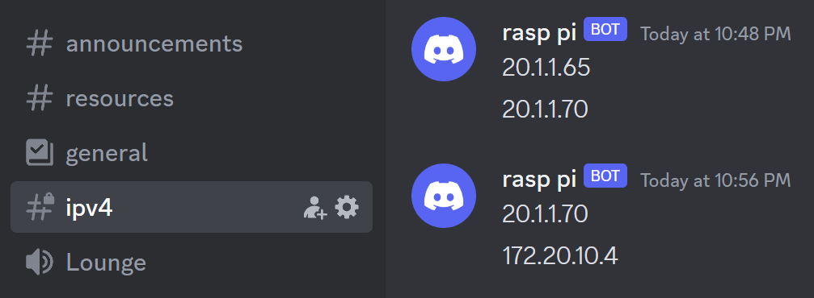

# rasp-pi-address-revealer
Find out the address (for ssh) of your Raspberry PI without admin on your internet
1. Create a Discord-Bot
2. Add the Discord-Bot to your server
3. Create a text-channel
4. Put the channel ID and token of the bot into the variables at the top of script.py
5. Place the script.py file on the Desktop of your Raspberry PI
6. Make the script.py file run on [startup](https://www.makeuseof.com/how-to-run-a-raspberry-pi-program-script-at-startup/)
7. Done!

